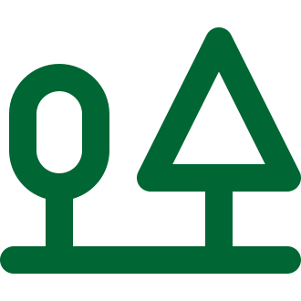
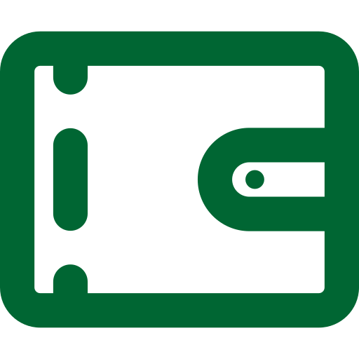

# Icons

> Transparency replaced by WHITE for these files

enum | x16 | x24 | x32 | x48
:-- | --- | --- | --- | ---
ACC_ICON_ABOUT |   |   |   |  
ACC_ICON_CAT |   |   |   |  
ACC_ICON_CLOCK |   |   |   |  
ACC_ICON_COINS |   |   |   |  
ACC_ICON_DOG |   |   |   |  
ACC_ICON_EURO |   |   |   |  
ACC_ICON_FLAG |   |   |   |  
ACC_ICON_HOURGLASS |   |   |   |  
ACC_ICON_MONEY |   |   |   |  
ACC_ICON_PAYPAL |   |   |   |  
ACC_ICON_RUBIK |   |   |   |  
ACC_ICON_TREES |   |   |   |  
ACC_ICON_WALLET |   |   |   |  
ACC_ICON_WORK |   |   |   |  
